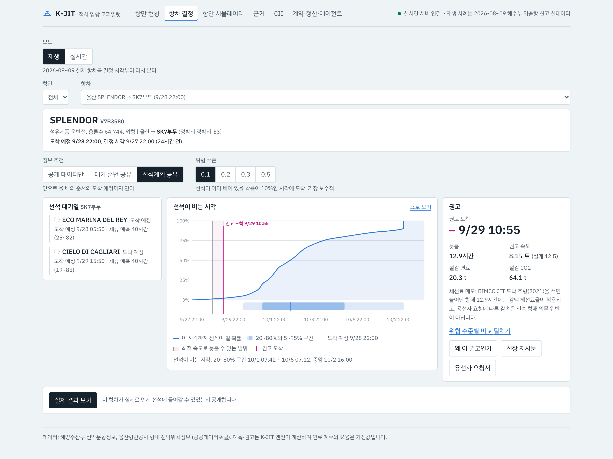
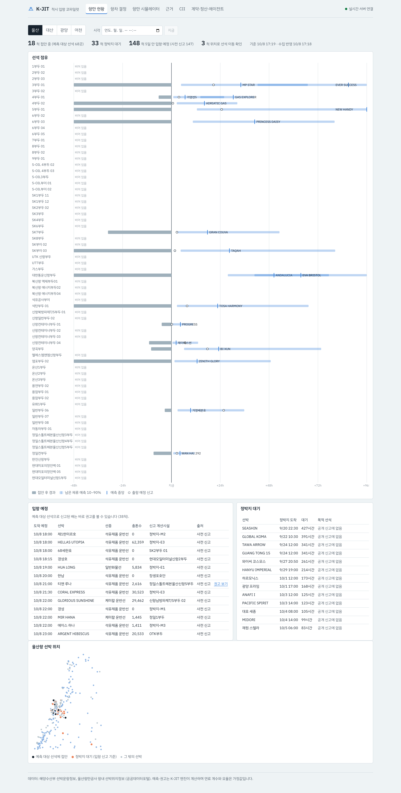

# 아이디어 기획서 초안

공고 [붙임2] 아이디어 기획서 양식의 목차(1. 개요, 2.1~2.7)를 그대로 따른다. 분량은 A4 10매 이내이고, 1절 개요는 A4 1매 이내이다. 수치는 저장소의 실측 문서(`docs/실측-A-*`, `docs/실측-BC-*`)와 조사 노트에 있는 값만 쓴다. `(팀 확정)`은 팀이 정해야 하는 칸, `(가정)`은 실측이 아닌 가정값이다.

| 항목 | 내용 |
|---|---|
| 참가자 | (팀 확정) |
| 응모명 | K-JIT: 선석 가용 확률 예측 기반 적시 입항(JIT) 코파일럿 |
| 대표 Track | 해운 AX (팀 확정) |
| 핵심 키워드 | 예측/최적화, 탄소 규제(CII) 대응, 계약 정산 자동화 |

---

## 1. 개요

### 1.1 핵심내용 요약

국내 벌크·탱커 항만에서 선석이 언제 비는지를 확률로 예측하고, 그 분포로 중소선사에 감속 도착 시각과 속도를 권고하는 AI 코파일럿이다. 선박이 정박지에 먼저 도착해 기다리며 버리는 연료와 CO2를 줄이되, 늦게 도착해 선석이 비는 시간(선석 유휴)은 늘리지 않는 것이 목표이다. 공개 데이터와 선박대리점의 대기 순번만으로 시작할 수 있고, 항만이 선석계획을 공유하면 효과가 커진다.

### 1.2 배경 및 필요성

- **정박지 대기의 낭비:** 선박은 용선계약의 신속 항해 의무와 선착순 관행 때문에 선석이 비기 전에 서둘러 도착해 기다린다. 해양수산부 입출항 신고 1년치(2025-10~2026-09, 129,831항차)를 분석한 결과, 대산·울산·광양에서 정박지를 거친 항차의 약 절반(48.2%, 46.7%, 49.2%)이 12시간 넘게 선석을 기다렸다.
- **강화되는 탄소 규제:** IMO CII 감축률(2019년 대비)은 2027년 13.625%에서 2030년 21.500%로 해마다 강화된다(MEPC.400(83)). 정박 대기 연료도 CII에 그대로 잡히지만, 대기시간 보정은 아직 채택되지 않았다.
- **국내 공백:** 국내에는 항만 앞 20해리 구간의 저속운항제만 있고, 접근 항해 전체에서 도착 시각을 맞추는 JIT 체계는 없다. 싱가포르는 2023-10부터 JIT 플랫폼을 전면 시행하고 있다.

### 1.3 활용 Scene 및 기술

중소 탱커선사의 운항 담당자가 도착 72시간 전에 K-JIT를 연다. 목적 선석에 붙어 있는 배와 정박지 대기 순번을 보고, 선석이 비는 시각의 분포(P10/P50/P90)를 확인한다. 위험 수준을 고르면 권고 도착 시각과 속도, 절감 연료·CO2, 체선료 정산 영향이 나오고, 선장 지시문과 용선자 요청서 초안이 함께 만들어진다.

- **AI·데이터:** 머신러닝 분위수 회귀(gradient boosting)와 conformal 보정으로 선석 체류 분포를 예측하고, 대기열 몬테카를로로 선석 가용 시각의 분포를 만든다. 생성형 AI(LLM 에이전트)는 대리점 메일과 용선계약 같은 비정형 문서를 구조화하고 근거를 설명한다.
- **데이터:** 해수부 선박운항정보(입출항 신고), 항만시설사용정보, 울산항만공사 항내 선박위치 등 공개 API로 시작한다.

### 1.4 기대효과

- **정량:** 시험 구간(2026-08~09, 4개 항만 1,253항차) 백테스트에서 공개 데이터와 대기 순번만으로 연료 412~983t, 선석계획 공유 시 1,923t을 줄였다. 추가 선석 유휴는 모든 조건에서 합계 27~64시간에 그쳤다.
- **정성:** 중소선사의 CII 등급 관리 부담을 줄이고, 선주·용선자 사이의 감속 합의를 정산 수치로 돕는다. 정박지 혼잡과 항만 대기오염도 줄어든다.

---

## 2. 상세 내용

### 2.1 문제 정의 / 적용 대상

**현장 문제.** 벌크·탱커선은 "hurry up and wait" 관행을 따른다. 항해용선계약은 선박에 신속 항해(utmost despatch)를 요구하고, 많은 항만이 먼저 온 순서로 선석을 배정한다. 그래서 선박은 선석이 언제 빌지 모르는 채 최고 속도로 와서 정박지에서 기다린다. 이 대기 동안 쓰는 연료는 항해거리 없이 CO2만 늘린다.

**실측으로 확인한 규모.** 9개 항만 1년치 입출항 신고를 항차 단위로 복원하였다(표 1).

| 항만 | 정박지 경유 비율 | 정박지 경유 항차 중 12시간 초과 대기 |
|---|---|---|
| 대산 | 64.7% | 48.2% |
| 울산 | 25.2% | 46.7% |
| 광양 | 15.5% | 49.2% |

표 1. 화물선 정박지 대기 실측 (2025-10~2026-09, 해수부 입출항 신고). 대기는 선행 선박 출항 시각으로 복원한 하한 추정이며, 판정 기준을 바꿔도 43~51%가 유지된다.

**기존 방식의 한계.**

| 기존 | 한계 |
|---|---|
| 저속운항제(항만 앞 20해리) | 접근 항해 마지막 구간만 다루고, 선석 상황과 연결되지 않는다 |
| 선박 보고 ETD, 대리점 구두 정보 | 선석이 비는 시각의 불확실성을 숫자로 주지 않아 감속 판단의 근거가 되지 못한다 |
| 항로 최적화 서비스 | 해상 날씨·연료 최적화가 중심이고, 항만 선석 상황을 반영한 도착 시각 결정은 없다 |
| CII 관리 서비스(중소선사 바우처) | 사후 보고·등급 관리가 중심이고, 대기 손실을 운항 결정 단계에서 줄이지 않는다 |
| 대기시간 예측(KOBC AI-Born 실증 예시) | 예측만으로는 선사의 속도 결정과 계약 정산까지 이어지지 않는다 |

**적용 대상.**

| 사용자 | 하는 일 |
|---|---|
| 중소 벌크·탱커 선사 운항 담당 (주 사용자) | 권고 도착 시각·속도·절감량을 확인하고 선장에게 지시 |
| 용선자(화주) | JIT 감속 요청과 체선료 정산 영향 확인 |
| 선박대리점 | 대기 순번 정보를 선사에 전달, 메일 구조화로 입력 부담 감소 |
| 항만공사 선석 담당 (2단계) | 선석계획 공유, 가상 대기열 운영, 선석 유휴 모니터링 |

### 2.2 접근 방식 / 핵심 아이디어

**접근 방식.** 선석이 비는 시각을 점 하나로 맞히려 하지 않고 확률 분포로 예측한 뒤, 그 분포 위에서 "일찍 와서 기다리는 비용"과 "늦게 와서 선석을 비우는 위험"을 함께 따져 도착 시각을 고른다.

**주요 기능.**

| 기능 | 내용 |
|---|---|
| 예측 | 목적 선석에 붙어 있는 배와 줄 선 배들의 남은 체류를 분위수로 예측하고, 이어 붙여 선석이 비는 시각의 분포를 만든다 |
| 결정 | 위험 수준(늦게 도착할 확률의 상한)에 맞는 권고 도착 시각(RTA)과 속도를 낸다 |
| 정산 | 절감 연료·CO2, 연간 CII 등급 변화, BIMCO JIT 조항(2021) 기준 체선료 정산 영향을 계산한다 |
| 소통 | 대리점 대기 순번 메일·항만 공지·용선계약을 구조화하고, 권고 근거 설명과 선장 지시문·용선자 요청서 초안을 만든다 |

**정보 조건에 따른 단계.** 누가 정보를 내놓느냐에 따라 단계를 나눈다. 1단계는 항만 규칙을 바꾸지 않고 이미 있는 정보만으로 시작한다(표 2).

| 단계 | 쓰는 정보 | 정보 제공 주체 | 시험 구간 효과 (위험 수준 0.1) |
|---|---|---|---|
| 1단계 최소 | 지금 선석에 붙어 있는 배 | 해수부 공개 API | 완전 정보 상한의 12% |
| 1단계 | 위에 더해 정박지 대기 선박의 목적 선석과 순번 | 참여 선사의 선박대리점·터미널 | 상한의 28% |
| 2단계 | 위에 더해 앞으로 올 선박의 순서와 도착 예정 | 항만공사·터미널 선석계획 | 상한의 56% |

표 2. 정보 조건별 단계와 효과. 완전 정보 상한은 실제 선석 가용 시각을 미리 알았을 때의 절감량이다.

**차별성과 강점.**

- **예측에서 결정·정산까지:** 대기시간 예측을 선사의 속도 결정과 계약 정산까지 잇는다. KOBC가 추진하는 대기시간 예측 결과를 입력으로 받을 수 있는 의사결정 계층이다.
- **불확실성을 숨기지 않는다:** 점 예측 대신 분포를 쓰고, 위험 수준을 사용자가 고른다. 선석 유휴가 늘지 않는지를 함께 보고한다.
- **바로 시작할 수 있다:** 1단계는 공개 API와 업계 관행 정보(대기 순번)만 쓴다.
- **이해관계 조정:** 감속의 이익과 손해는 계약 형태에 따라 선주와 용선자에게 나뉜다. 정산 기능이 그 차이를 숫자로 보여 준다(표 3).

| 당사자 | 이익 | 손해·위험 | K-JIT의 보완 |
|---|---|---|---|
| 선주 (항해용선) | 연료비 절감, CII 등급 개선 | 체선료 수입 감소, 신속 항해 의무 위반 우려 | BIMCO JIT 조항 기준 정산 계산 |
| 용선자·화주 (항해용선) | 체선료 지급 감소, Scope 3 배출 감소 | 선석이 일찍 비면 하역 지연 | 위험 수준으로 늦은 도착 확률 관리 |
| 항만·터미널 | 정박지 혼잡·대기오염 감소 | 늦은 도착 시 선석 유휴 | 추가 유휴를 공개 지표로, 2단계 가상 대기열 |
| 선박대리점 | 대기 순번 정보를 서비스로 활용 | 정보 제공 업무 증가 | 메일 구조화로 입력 부담 감소 |

표 3. 당사자별 이익과 손해

### 2.3 활용 시나리오 및 화면 구성

**업무 시나리오 (울산항 입항 예정 석유제품선).**

1. **사용자 입력:** 운항 담당자가 항만 현황 화면에서 자기 배를 고르거나 항차 정보(선종, 톤수, 도착 예정, 목적 선석)를 넣는다. 대리점에서 받은 대기 순번 메일을 붙여 넣는다.
2. **AI/시스템 처리:** 에이전트가 메일에서 선박명·순번·목적 선석을 뽑아 대기열을 채운다(프로토타입은 규칙 기반 추출, 시범 단계에서 LLM 연결). 예측 엔진이 점유 선박과 대기 선박의 남은 체류를 분위수로 예측하고 선석 가용 시각 분포를 만든다.
3. **결과 제공:** 분포(P10/P50/P90), 위험 수준별 권고 도착 시각과 속도, 절감 연료·CO2, 체선료 정산 영향, 근거 설명을 보여 준다.
4. **후속 조치:** 선장 지시문과 용선자 요청서 초안을 사람이 확인해 보낸다. 실제 접안 시각이 들어오면 예측과 비교해 기록하고, 항차별 절감 실적을 누적한다.

**화면 구성 (프로토타입).**

| 화면 | 내용 |
|---|---|
| 항만 현황 | 선석 점유, 정박지 대기, 입항 예정 선박. 항차 결정의 입구 |
| 항차 결정 | 핵심 흐름 전체. 실시간 모드와, 과거 항차를 재생해 실제 결과와 비교하는 재생 모드 |
| 항만 시뮬레이터 | 항만 전체에 JIT 정책을 적용했을 때의 대기·연료·선석 이용률 변화 |
| 근거 | 정박지 대기 실측, 예측 성능, 백테스트 결과와 한계 |
| CII 시뮬레이터 | 선박 제원과 연간 운항값으로 2027~2030 등급 변화 |
| 계약·정산·에이전트 | 조항 추출, 메일 구조화, 정산 계산, 지시문 생성, 질의응답 |

모든 화면에 데이터 상태(실시간·재생·저장본)를 표시하고, 가정값과 규칙·LLM으로 만든 문장에는 표시를 붙인다.

그림 1. 항차 결정(재생): 2026-09 울산 SK7부두 탱커. 선석계획 공유 조건에서 앞 순번 2척을 반영한 선석 가용 분포와 권고 도착

그림 2. 항만 현황: 울산 단일 접안 선석의 점유와 남은 체류 예측, 입항 예정, 정박지 대기, 선박 위치

**프로토타입 제출.** 수집 서버·예측과 결정 엔진·API·웹 6화면·에이전트를 모두 구현했다(공개 저장소). 제출하는 웹 앱(GitHub Pages)과 단일 HTML은 2026-10-08 공개 데이터로 고정한 배포본이다. 입항 예정 선박의 권고와 시뮬레이터 결과는 그 시각에 엔진으로 미리 계산해 넣었고, 실시간 수집·직접 입력 계산·질의응답은 저장소의 서버를 실행하면 동작하며 시연 영상에 담았다.

### 2.4 AI/데이터 활용 및 구현 구조

**데이터.**

| 데이터 | 확보 방식 | 용도 |
|---|---|---|
| 해수부 선박운항정보(입출항 신고) | 공공데이터포털 API (자동승인) | 선석 점유 복원, 학습, 실시간 상태 |
| 해수부 항만시설사용정보 | 공공데이터포털 API | 선석 정보 |
| 울산항만공사 항내 선박위치 | 공공데이터포털 API, 5분 주기 수집 | 정박지·선석 판정 보강, 대기 추정 검증 |
| 대리점 대기 순번 (1단계) | 참여 선사의 대리점 메일 | 대기열 구성 |
| 항만 선석계획 (2단계) | 항만공사와 데이터 협약 (KOBC 중재) | 앞으로 올 선박의 순서 |

**AI 구성.**

| 구성 | 기술 | 역할 |
|---|---|---|
| 선석 가용 예측 (핵심) | 분위수 gradient boosting + conformal 보정(CQR) | 선석·선종·화물·경과 시간·정박지 혼잡으로 남은 체류 분포를 예측. 1년치로 학습·검증 |
| 불확실성 전파 | 대기열 몬테카를로, 확률 재보정 | 줄 선 선박들의 체류를 이어 붙여 선석 가용 시각 분포 생성 |
| 의사결정 | 위험 고려 최적화 | 위험 수준에 맞는 도착 시각·속도 선택 |
| 비정형 입력·설명 | LLM 에이전트 | 메일·공지·계약 구조화, 조항 근거 인용, 권고 설명, 지시문 초안, 질의응답(예측·최적화 도구 호출) |

수치(예측, 절감량, 정산)는 머신러닝 모델과 결정적 계산에서만 나오고, LLM은 입력 구조화와 설명·초안만 맡는다. 제출 프로토타입은 LLM을 끈 상태로 같은 기능을 규칙·템플릿과 엔진 도구로 수행하며, LLM 연결(비용 상한·결과 검증 포함)은 구현되어 있어 키를 넣으면 켜진다. LLM은 KOBC가 실증 중인 EXAONE 기반 해양 특화 LLM 같은 온프레미스 모델로 바꿔 쓸 수 있게 분리한다.

**검증 결과 (시험 구간 2026-08~09).**

| 측정 | 결과 |
|---|---|
| 남은 체류 예측 (8,903개 표본) | 중앙값 오차 24.0시간. 선석 최근 체류 기준선 30.3시간보다 21% 개선. CQR 보정 후 80% 구간 적중률 77.7% |
| JIT 결정 백테스트 (1,253항차, 위험 수준 0.1) | 1단계 연료 412~983t(상한의 12~28%), 2단계 1,923t(상한의 56%) 절감. 추가 선석 유휴 합계 27~64시간 |

표 4. 예측과 결정의 검증 결과

선석 체류는 중앙값이 32~52시간이고 상위 10%가 며칠에 이르는 긴 꼬리 분포라서, 중앙값 오차 24시간은 기준선 대비로 읽어야 한다. K-JIT는 분포의 아래쪽 분위수로 보수적으로 결정하므로, 성능은 결정 백테스트(절감과 추가 유휴)로 평가한다.

**구현 구조.** 공개 API를 주기적으로 수집해 운영 DB에 쌓고(신고 30분, 울산 위치 5분), 상태 빌더가 선석 점유·정박지 대기·입항 예정을 만든다. 예측·결정 엔진과 에이전트를 API 서버로 제공하고, 웹 앱이 이를 화면에 보여 준다. 서버가 없으면 웹 앱은 내장 저장본으로 동작한다. 에이전트는 LLM 없이도 규칙·템플릿과 엔진 도구로 같은 기능을 하며, LLM을 켜면 결과를 원문·엔진 수치와 대조해 근거 없는 수치가 있으면 템플릿으로 되돌린다.

**기존 시스템 연계.** 해수부 Port-MIS 계열 공개 데이터를 그대로 쓰므로 항만 쪽 신규 시스템이 필요 없다. 2단계에서는 항만공사 선석계획을 API로 받는다. 선사 쪽 결과는 IMO DCS·CII 보고 근거 자료로 내보낼 수 있다.

### 2.5 실행 계획

| 단계 | 기간 | 범위 |
|---|---|---|
| 0. 데이터 협약 | 2027년 1분기 | KOBC 중재로 항만공사 1곳(울산 또는 여수광양)과 데이터 협약. KOBC 지원 중소선사 2~3곳 참여 |
| 1. 권고형 JIT 시범 | 2027년 2~3분기 | 공개 입출항 신고와 참여 선사 대리점의 대기 순번으로 권고 도착 시각 제공. 대기열 규칙은 바꾸지 않는다 |
| 2. 선석계획 공유·가상 대기열 시범 | 2027년 4분기~ | 항만공사와 선석계획 공유, 가상 대기열 규칙 시범, 저속운항제 인센티브를 JIT 참여로 확장하는 방안 검토 |
| 3. 플랫폼 개방 | 2028년~ | KOBC AX 플랫폼 서비스로 개방, 다른 항만으로 확대 |

표 5. 단계별 추진 계획

- **시범 적용 범위:** 항만 1곳의 단일 접안 벌크·탱커 선석, 참여 선사 2~3곳.
- **필요 인력:** (팀 확정) 예: 데이터·ML 1명, 백엔드 1명, 해운 업무(운항·용선) 자문 1명.
- **소요 비용:** (팀 확정) 공공데이터 API는 무료이다. 서버 1대, LLM API 사용료(일일 상한 운영), 시범 기간 인건비로 구성한다.
- **필요 데이터·기술:** 2.4절의 공개 API(확보 완료), 대리점 대기 순번(참여 선사 협조), 선석계획(항만 협약).

### 2.6 기대효과 및 성과 지표

**정량 효과.**

- 시험 두 달 4개 항만에서 1단계 연료 412~983t, 2단계 1,923t 절감(표 4).
- 연간 환산(참고, 4개 항만): 1단계 연료 약 2,500~6,000t(CO2 약 7,900~18,800t), 2단계 연료 약 11,700t(CO2 약 36,800t). 시험 두 달의 비율을 연간 상한에 곱한 값이며 계절 변동은 반영하지 않았다.
- 선석 유휴 증가는 모든 조건에서 시험 두 달 합계 27~64시간.

**정성 효과.**

- **품질(Q):** 감속 결정의 근거가 숫자로 남아 선주·용선자 합의와 사후 정산이 쉬워진다.
- **비용(C):** 연료비와 체선료 분쟁 비용이 줄고, 중소선사의 CII 등급 하락에 따른 운항 제약 위험이 줄어든다.
- **납기(D):** 위험 수준으로 늦은 도착 확률을 관리해 하역 일정에 주는 영향을 통제한다.
- **환경·항만:** 정박지 혼잡과 항만 인근 대기오염이 줄어든다(저속운항제와 같은 목표).

**성과 지표.**

| 지표 | 측정 방법 |
|---|---|
| 항차당 정박지 대기시간 | 참여 항차의 정박지 도착~접안 시각 |
| 항차당 절감 연료·CO2 | 권고 속도 대비 기존 속도의 연료 계산, 실적 누적 |
| 선박별 CII 등급 변화 | IMO G2·G4 기준 연간 계산 |
| 예측 구간 적중률 | 80% 구간에 실제 가용 시각이 들어간 비율 |
| 항만 선석 유휴시간 | 참여 전후 비교 (늘지 않아야 함) |
| 참여 선박 수 | 단계별 누적 |

### 2.7 리스크 및 대응 방안

| 구분 | 리스크 | 대응 |
|---|---|---|
| 현장 적용 | 선착순 대기열에서 감속하면 순번을 잃음 | 1단계는 선석 배정이 미리 확정되는 선박부터 적용. 2단계에서 항만과 가상 대기열 규칙 시범 |
| 현장 적용 | 체선료를 받는 선주가 감속을 꺼림 | BIMCO JIT 조항(2021) 기준으로 정산 영향을 계산해 양측에 제시 |
| 기술 구현 | 예측 정확도 한계 (80% 구간 적중률이 재보정 후에도 일부 46~75%) | 점 예측 대신 분포와 위험 고려 결정. 적중률과 추가 유휴를 공개 지표로 관리 |
| 기술 구현 | 정박지 대기는 하한 추정 | 울산 항내 선박위치로 교차 검증 중. 시범 단계에서 실측 대기로 교체 |
| 데이터 확보 | 대기 순번·선석계획 접근 | 공개 API로 시작하고, 대기 순번은 참여 선사 대리점, 선석계획은 KOBC 중재 협약으로 확보 |
| 데이터 확보 | 공공데이터 트래픽 한도 | 수집 주기 조정, 시범 단계에서 운영계정 전환 |
| 비용 | LLM 사용료 | 일일 비용 상한, 실패 시 템플릿 폴백. 온프레미스 LLM 전환 가능 구조 |
| 중복 | KOBC·LG CNS의 대기시간 예측 과제와 겹침 | 의사결정·정산 계층으로 차별화하고 KOBC 예측 결과를 입력으로 받는 연계 구조 제시 |
| 보안·개인정보 | 용선계약 등 영업 문서 처리 | 문서는 운영 DB에만 저장, 외부 LLM 사용 시 비식별화 또는 온프레미스 모델 |
| 규제 | 선박 위치정보 이용 | 서비스 운영 주체가 위치정보법상 위치기반서비스사업 신고 의무를 검토. 공모전 프로토타입은 위치정보를 제3자에게 제공하지 않는다 |
| 저작권 | 학습·참고 자료 | 공공데이터 이용허락 범위 준수, 인용 출처 표기 |

표 6. 리스크와 대응

---

## 선택 제출자료 안내사항 (프로토타입)

| 항목 | 내용 |
|---|---|
| 형태 | 웹 앱(공개 URL), 단일 HTML 저장본, 시연 영상 |
| 여는 방법 | URL 접속 또는 HTML 파일을 브라우저로 열기. 로그인·설치 없음 |
| 핵심 기능 | 항차 결정(예측→권고→정산→초안), 항만 현황, 항만 시뮬레이터, 근거, CII 시뮬레이터, 계약·정산·에이전트 |
| 고정 기준 | 코드와 배포본은 제출일 기준(배포본 데이터는 2026-10-08 공개 데이터). 실시간 수집·직접 입력 계산·질의응답은 저장소의 서버 실행 시 동작하며 시연 영상에 있음 |
| URL·파일명 | 웹 앱 https://nl-hackerton.github.io/KOBC-AX-Idea-Contest/ , 저장소 https://github.com/NL-Hackerton/KOBC-AX-Idea-Contest , 첨부 zip의 k-jit.html(단일 HTML), k-jit-demo.mp4(시연 영상) |

## 작성 메모 (제출본에서 삭제)

- 출처: 실측 수치는 `docs/실측-A-정박지대기-2026-10-08.md`, `docs/실측-BC-선석예측-JIT백테스트-2026-10-08.md`, 규제·주최 측 현황은 `docs/조사-노트-2026-10-08.md`, 계획·리스크는 `docs/아이디어-제안.md`, 화면은 `docs/프로토타입-기획.md`.
- 팀 확정 필요: 참가자, 대표 Track, 필요 인력·소요 비용.
- 그림 넣을 자리: 1.3 활용 Scene(흐름도 1장), 2.4 시스템 구조도 1장. 2.3 화면 캡처 2장은 md에 넣었고(docs/images/screens), HWPX에는 한글에서 직접 붙인다.
- 분량 확인: 1절은 A4 1매 이내, 전체 10매 이내. 표·그림을 넣은 뒤 한글 양식에서 다시 확인한다.
